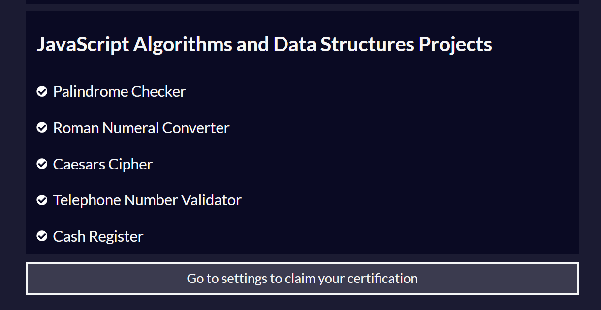
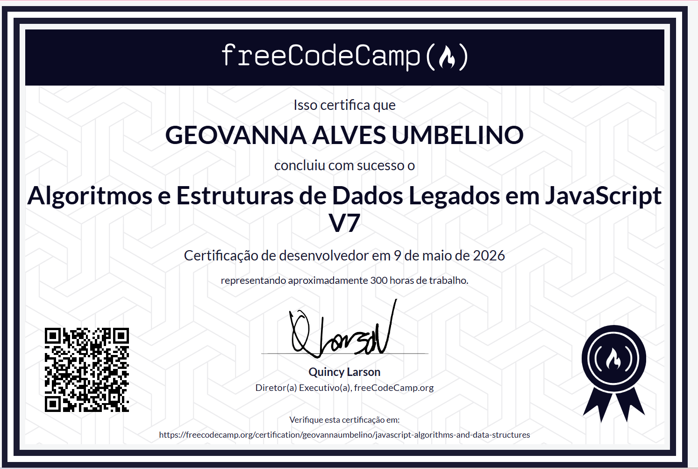

# Desafio 1 - Algoritmos e Lógica de Programação em JavaScript

Este repositório contém a minha entrega para o Desafio 1 da trilha de capacitação em Back-end da **EngNet Consultoria**.O projeto consiste na  resoluções dos desafios propostos no curso **JavaScript Algorithms and Data Structures** do freeCodeCamp. 

## 📌 Escopo do Ciclo de Capacitação

Durante este ciclo, foram concluídas as seguintes seções:

- [x] **Basic Data Structures**: Manipulação de arrays e objetos.
- [x] **Basic Algorithm Scripting**: Resolução de problemas fundamentais.
- [x] **Object Oriented Programming (OOP)**: Princípios de classes, protótipos e herança.
- [x] **Functional Programming**: Uso intensivo de métodos como `map`, `filter`, `reduce`, `sort`, `slice` e `concat`.
- [x] **Intermediate Algorithm Scripting**: Desafios de lógica de nível intermediário.
- [x] **JavaScript Algorithms and Data Structures Projects**: As 5 atividades finais para obtenção da certificação.

---

## 🏆 Projetos Finais de Certificação

Os códigos que solucionam as 5 atividades obrigatórias estão disponíveis neste repositório:
1. **Palindrome Checker**
2. **Roman Numeral Converter**
3. **Caesars Cipher**
4. **Telephone Number Validator**
5. **Cash Register**

---

## 📸 Comprovação de Conclusão

Abaixo estão os registros que validam a conclusão dos módulos e projetos exigidos:

### Atividades Realizadas

### Certificado

---

## 🛠️ Tecnologias
- JavaScript 
- Git e GitHub

